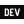

I am a **web enthusiast** with a strong passion for creating and developing solutions.

Over the course of 5 years at university, I honed my skills in this field. Following my education, I joined [KNP Labs](https://knplabs.com) where I continue to expand my knowledge and expertise.

Recently, I have been delving deep into **hexagonal architecture** with **Symfony** and **React**. Additionally, I have ventured into **mobile development** using **React Native**.

This journey has kept me at the forefront of emerging technologies and up-to-date with the latest advancements in the web industry. My goal is to keep pushing the boundaries of my skills and to explore exciting new possibilities in the world of web and mobile development.

<hr/>

🌐 **Connect with me**

[](https://linkedin.com/in/clementvtrd)&nbsp;&nbsp;&nbsp;[](https://dev.to/clementvtrd)

<!--START_SECTION:waka-->
**🐱 My GitHub Data** 

> 📦 11.1 kB Used in GitHub's Storage 
 > 
> 🏆 1,869 Contributions in the Year 2023
 > 
> 🚫 Not Opted to Hire
 > 
> 📜 5 Public Repositories 
 > 
> 🔑 4 Private Repositories 
 > 
**I'm an Early 🐤** 

```text
🌞 Morning                24980 commits       ███████████░░░░░░░░░░░░░░   42.10 % 
🌆 Daytime                29776 commits       █████████████░░░░░░░░░░░░   50.19 % 
🌃 Evening                3928 commits        ██░░░░░░░░░░░░░░░░░░░░░░░   06.62 % 
🌙 Night                  647 commits         ░░░░░░░░░░░░░░░░░░░░░░░░░   01.09 % 
```
📅 **I'm Most Productive on Tuesday** 

```text
Monday                   13306 commits       ██████░░░░░░░░░░░░░░░░░░░   22.43 % 
Tuesday                  14125 commits       ██████░░░░░░░░░░░░░░░░░░░   23.81 % 
Wednesday                12055 commits       █████░░░░░░░░░░░░░░░░░░░░   20.32 % 
Thursday                 12137 commits       █████░░░░░░░░░░░░░░░░░░░░   20.46 % 
Friday                   7510 commits        ███░░░░░░░░░░░░░░░░░░░░░░   12.66 % 
Saturday                 51 commits          ░░░░░░░░░░░░░░░░░░░░░░░░░   00.09 % 
Sunday                   147 commits         ░░░░░░░░░░░░░░░░░░░░░░░░░   00.25 % 
```


📊 **This Week I Spent My Time On** 

```text
💬 Programming Languages: 
PHP                      2 hrs 17 mins       ████████████████░░░░░░░░░   64.48 % 
YAML                     30 mins             ████░░░░░░░░░░░░░░░░░░░░░   14.22 % 
Markdown                 19 mins             ██░░░░░░░░░░░░░░░░░░░░░░░   09.00 % 
Git Config               10 mins             █░░░░░░░░░░░░░░░░░░░░░░░░   04.89 % 
XML                      6 mins              █░░░░░░░░░░░░░░░░░░░░░░░░   03.01 % 
```

**I Mostly Code in PHP** 

```text
PHP                      17 repos            ████████████░░░░░░░░░░░░░   50.00 % 
TypeScript               8 repos             ██████░░░░░░░░░░░░░░░░░░░   23.53 % 
Dockerfile               2 repos             █░░░░░░░░░░░░░░░░░░░░░░░░   05.88 % 
HCL                      1 repo              █░░░░░░░░░░░░░░░░░░░░░░░░   02.94 % 
HTML                     1 repo              █░░░░░░░░░░░░░░░░░░░░░░░░   02.94 % 
```


 Last Updated on 24/07/2023 UTC
<!--END_SECTION:waka-->
